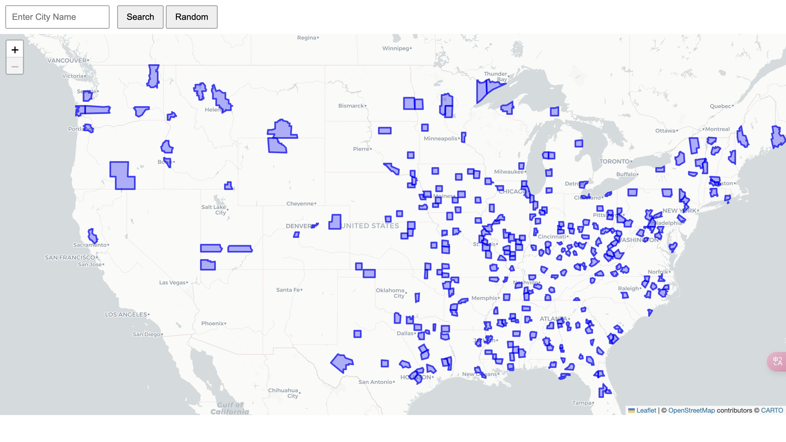

# CityBlazer

**CityBlazer** is a simple, interactive map application that allows users to display geographic regions based on city names. It offers several features for visualizing cities and their geographic boundaries. Below are the key functionalities and how to use them.

## Features

1. **Query and Highlight a Single City**
   * Users can input the name of a city, and the corresponding region will be highlighted on the map. The region’s boundaries are retrieved from a backend service and displayed in an interactive, visually appealing format.

2. **Randomly Highlight Multiple Cities**
   * The app can randomly generate and highlight the regions of multiple cities on the map. The number of cities to highlight can be customized, making it easy to visualize larger areas or multiple locations at once.

3. **Click to Get City Information**
   * Once a city is highlighted, users can click on the highlighted region to see a popup with the city’s name and any additional information. This can be expanded to show more details, such as population, landmarks, or weather information.

## Additional Notes

• The backend server is responsible for querying city coordinates from a database (e.g., MongoDB) and sending them to the front-end.

• The front-end uses **Leaflet.js** to render the map and display GeoJSON layers representing the city boundaries.

• The **popup** feature allows users to click on highlighted cities and view their names or other details.

This should give users a solid understanding of the app and how to use it, as well as a roadmap for future development.
